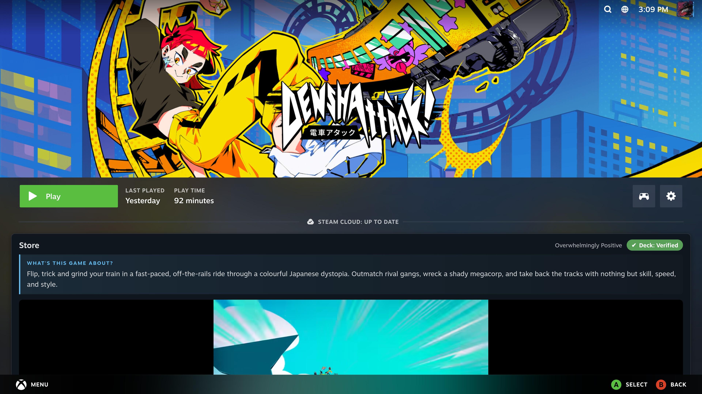
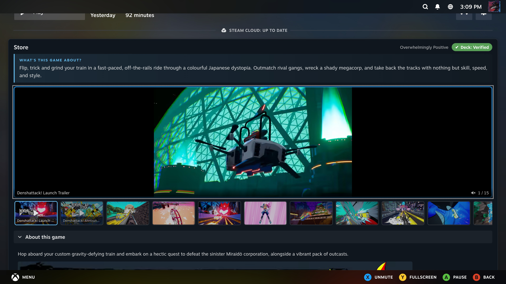
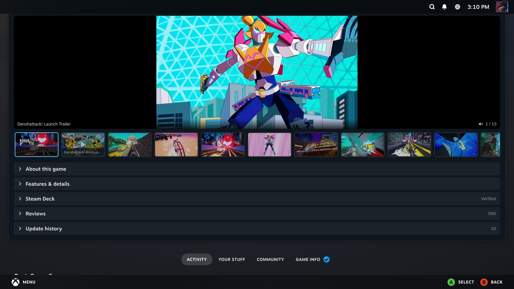
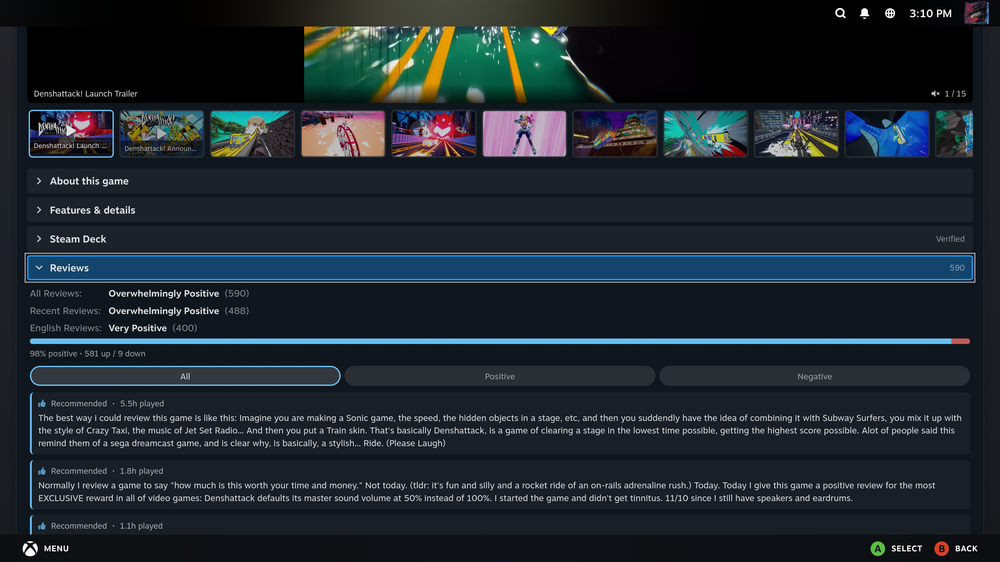

# EnhancedGV

*Enhanced Game View — brings the Steam store page onto your library game-detail page.*

A [Decky Loader](https://decky.xyz/) plugin for SteamOS / Steam Deck that brings
the content normally shown on a game's **store page** — trailers, screenshots,
description, features, reviews, Steam Deck compatibility and update history —
onto the game's **library details page**, rendered *below* the header so it never
covers or blocks the **Play** button.



## What it adds to the library page

Injected into the scrollable content area beneath the hero/Play button:

| Section | Source | Contents |
|---|---|---|
| **Header row** | store + deck | Review summary + Steam Deck compatibility badge |
| **Media** | `appdetails` | Trailer thumbnails (tap to play) + screenshots (tap to zoom) |
| **About this game** | `appdetails` | Full description (sanitized HTML), expandable |
| **Features & details** | `appdetails` | Genres/categories, developer, publisher, release date, platforms, controller support, Metacritic, price, languages |
| **Steam Deck compatibility** | deck report | Verified/Playable/Unsupported + reviewer notes |
| **Reviews** | `appreviews` | Score summary, positive %, recent review cards |
| **Update history** | `ISteamNews` | Recent patch notes / announcements (tap to read) |

Everything is gamepad-navigable and each section is collapsible. Section
visibility and cache clearing are controlled from the plugin's **Quick Access**
panel.

## Screenshots

| | |
|---|---|
|  |  |
| *Media gallery — trailers stream in place; A pauses, Y fullscreen, X mutes.* | *Collapsible sections: About, Features, Steam Deck, Reviews, Update history.* |
|  |  |
| *Reviews — all-time / recent / localized scores, filter chips, selectable cards.* | *The store summary sits below Play, never covering it.* |

## How it works

- **Frontend** (`src/`, TypeScript/React via `@decky/api` + `@decky/ui`): patches
  the `/library/app/:appid` route with `routerHook.addPatch`, walks the Steam
  React tree (`afterPatch` → `wrapReactType` → `findInReactTree` on
  `appDetailsClasses.InnerContainer`) and splices `<StorePanel/>` in just below
  the header. Every hop is guarded so a Steam client update degrades to "no
  panel" rather than crashing the page.
- **Backend** (`main.py`, Python stdlib only): fetches from Steam's store/web
  APIs (bypassing the browser's CORS restrictions), **normalizes and sanitizes**
  the JSON, converts news BBCODE → safe HTML, and caches responses to disk
  (`DECKY_PLUGIN_RUNTIME_DIR`) with per-kind TTLs plus negative caching and
  in-flight de-duplication to stay well under Steam's rate limits.

Data sources (no API key required):
`store.steampowered.com/api/appdetails`, `store.steampowered.com/appreviews`,
`api.steampowered.com/ISteamNews/GetNewsForApp`, and the store Deck
compatibility report endpoint.

## Build

Requires Node 18+ and Python 3. `pnpm` is recommended (it's what Decky uses), but
`npm` works too.

```bash
# with pnpm (recommended)
pnpm install
pnpm build

# or with npm
npm install
npm run build
```

This produces `dist/index.js`. The `main.py`, `plugin.json` and `package.json`
ship as-is.

## Install on a Steam Deck / SteamOS device

You need [Decky Loader](https://github.com/SteamDeckHomebrew/decky-loader)
installed, and Decky **Developer mode** enabled for the zip/dev flow.

### Option A — copy the folder (dev)

Copy this whole folder (after building, so `dist/` exists) to the Deck at:

```
~/homebrew/plugins/EnhancedGV/
```

so that it contains at least: `plugin.json`, `main.py`, `dist/index.js`,
`package.json`. Then restart Steam / reload Decky. Example from a PC:

```bash
scp -r "steam-store-panel" deck@<deck-ip>:"/home/deck/homebrew/plugins/EnhancedGV"
```

### Option B — install from ZIP (Decky → Developer → Install from ZIP)

Build first, then create a zip whose single top-level folder holds the plugin
files (`dist/`, `main.py`, `plugin.json`, `package.json`, `LICENSE`, `README.md`).

PowerShell (Windows):
```powershell
Compress-Archive -Path plugin.json,main.py,package.json,dist,LICENSE,README.md `
  -DestinationPath ..\SteamStorePanel.zip
```

bash (Deck/Linux/macOS):
```bash
zip -r ../SteamStorePanel.zip plugin.json main.py package.json dist LICENSE README.md
```

Then in the Decky menu: **Settings → Developer → enable Developer mode**, then
**Install Plugin from ZIP** and pick the file. Open any game in your library —
the store panel appears below the Play button.

## Configuration

Open the **Quick Access menu → EnhancedGV**:
- Toggle any of the six sections on/off.
- **Clear cached store data** to force a fresh fetch.

## Notes, limits & fragility

- **Steam client fragility (test on-device).** The injection depends on Steam's
  closed-source UI tree, which changes between client updates. The patch uses
  feature-based lookups (`appDetailsClasses.InnerContainer`, the AppOverview
  node) and bails out safely if the tree shape changes — but if a future Steam
  update stops the panel appearing, the tree-navigation in
  `src/patchLibraryApp.tsx` is the place to adjust (the same technique used by
  ProtonDB Badges / HLTB for Deck).
- **Trailers are best-effort.** Steam's `appdetails` no longer returns
  progressive `mp4`/`webm` URLs — only adaptive `dash`/`hls` manifests. The
  backend derives candidate `.mp4`/`.webm` URLs from the thumbnail path and the
  video modal tries them in order; if none play in the embedded browser, the
  poster remains. Screenshots are always reliable.
- **Non-Steam shortcuts / region-locked apps** have no store data; the panel
  simply doesn't render for them (cached briefly to avoid re-requests).
- **Rate limits.** The store endpoints are unofficial and throttle ~200 req /
  5 min per IP; the disk cache + de-dup keep normal usage far below that.
- **Privacy.** Requests go directly from your device to Steam's public APIs for
  the appid you're viewing. No API key, no third-party servers.

## Troubleshooting — the panel doesn't appear

The store content is injected into Steam's app-details page, whose internal React
tree is closed-source and shifts between client builds. If nothing shows up:

1. Open **Quick Access menu → EnhancedGV → Diagnostics (last game page)** after
   viewing a game. It reports, for the last game page rendered:
   - **InnerContainer class** — should be a hashed class name, not `MISSING`.
   - **Found renderFunc / Found game (appid) / Container matched / Panel injected.**
   - **Note** and, on failure, the list of container class names actually present.
2. The first `no`/`MISSING`/`none` row pinpoints the hop that failed:
   - `Found renderFunc = NO` → the route wrapper changed.
   - `Found game (appid) = NO` → the overview node moved.
   - `Container matched = none` → the scroll-container class changed; the
     "Container classes seen" line lists the real ones to target.
3. The Decky console log mirrors this with `[EnhancedGV]` lines.

Layout can be switched between stacked **sections** (default, most reliable) and
a **tab strip** under *Quick Access → EnhancedGV → Layout → Show as tabs*.

## Project layout

```
steam-store-panel/
├── plugin.json              # Decky manifest
├── package.json             # deps + build scripts
├── rollup.config.js         # re-exports @decky/rollup
├── tsconfig.json
├── main.py                  # Python backend: fetch + normalize + cache
├── decky.pyi                # type stub for `import decky` (editor only)
├── dist/index.js            # built frontend bundle (after `npm run build`)
└── src/
    ├── index.tsx            # definePlugin: registers patch + QAM panel
    ├── patchLibraryApp.tsx  # the /library/app/:appid injection
    ├── api.ts               # callable() bindings to main.py
    ├── types.ts             # shared TS types
    ├── hooks/useAppData.ts  # fetch-on-mount + module cache
    └── components/          # StorePanel + section components
```

## License

BSD-3-Clause. Not affiliated with Valve. "Steam" and "Steam Deck" are trademarks
of Valve Corporation.
