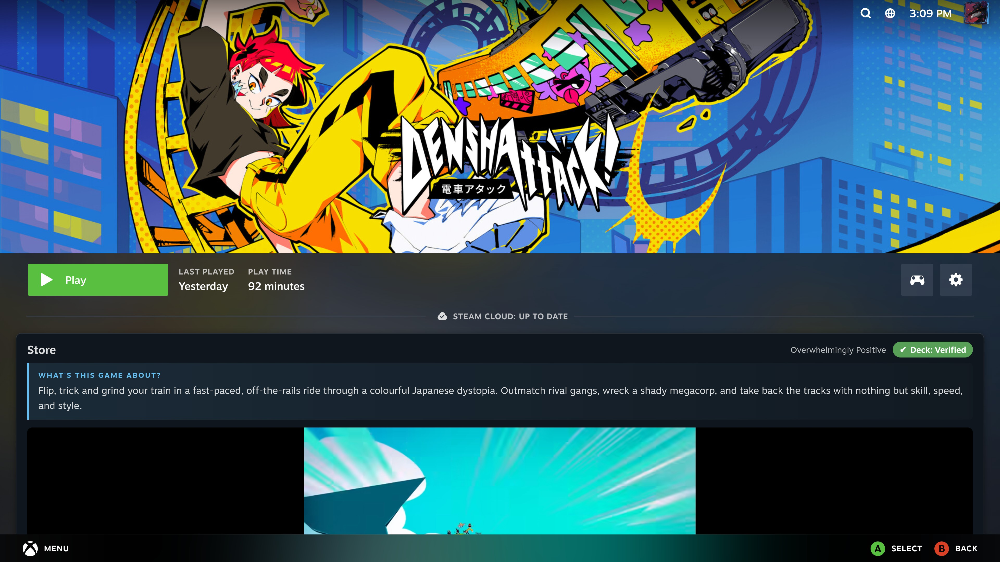
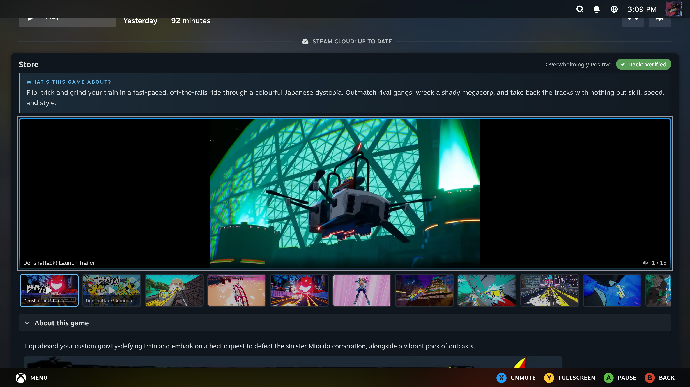
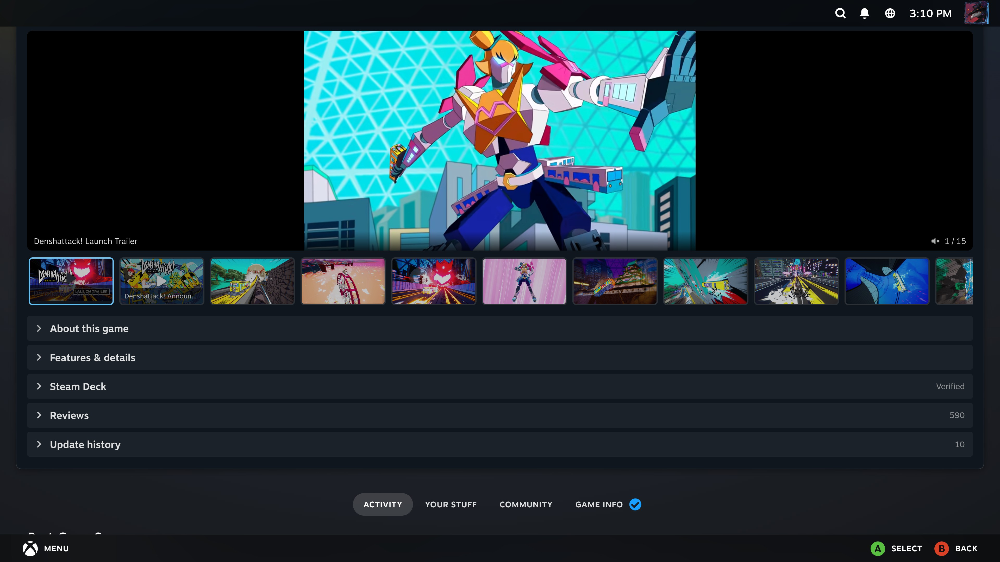
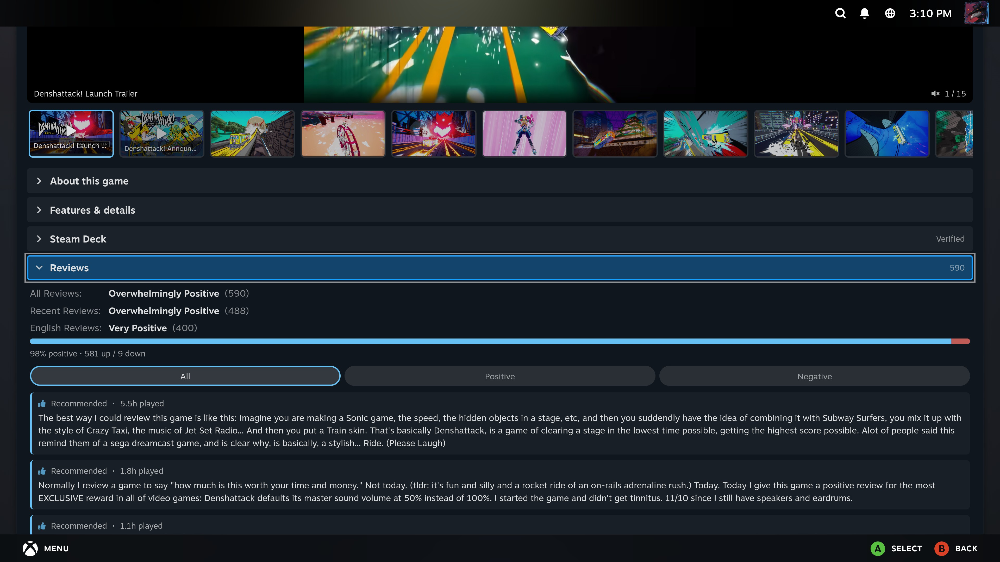

# EnhancedGV

*Enhanced Game View — brings the Steam store page onto your library game-detail page.*

A [Decky Loader](https://decky.xyz/) plugin for SteamOS / Steam Deck that brings
the content normally shown on a game's **store page** — trailers, screenshots,
description, features, reviews, Steam Deck compatibility and update history —
onto the game's **library details page**, rendered *below* the header so it never
covers or blocks the **Play** button. It works on **non-Steam games** too, by
matching them to a Steam store page automatically.



## What it adds to the library page

Injected into the scrollable content area beneath the hero/Play button:

| Section | Source | Contents |
|---|---|---|
| **Header row** | store + deck | Review summary + Steam Deck compatibility badge |
| **Media** | `appdetails` | Autoplaying trailers + screenshots — D-pad to browse, A to play/zoom, Y fullscreen, X mute |
| **About this game** | `appdetails` | Full description (sanitized HTML, with images and animated clips), expandable |
| **Features & details** | `appdetails` | Genres/categories, developer, publisher, release date, platforms, controller support, Metacritic, price, languages |
| **Steam Deck compatibility** | deck report | Verified/Playable/Unsupported + reviewer notes |
| **Reviews** | `appreviews` | All-time / recent / localized scores, positive %, filter chips, selectable review cards (A to read in full) |
| **Update history** | `ISteamNews` | Recent patch notes / announcements (tap to read) |

Everything is gamepad-navigable, each section is collapsible, and store content
follows your Steam client's language. Section visibility, default-expanded state,
per-game matching, and cache clearing are controlled from the plugin's **Quick
Access** panel.

## Screenshots

| | |
|---|---|
|  |  |
| *Media gallery — trailers stream in place; A pauses, Y fullscreen, X mutes.* | *Collapsible sections: About, Features, Steam Deck, Reviews, Update history.* |
|  |  |
| *Reviews — all-time / recent / localized scores, filter chips, selectable cards.* | *The store summary sits below Play, never covering it.* |

## How it works

- **Frontend** (`src/`, TypeScript/React via `@decky/api` + `@decky/ui`):
  deliberately **does not patch Steam's render function or mutate its render
  output** — so it coexists cleanly with other library plugins. Instead it mounts
  one component in Decky's own tree (`addGlobalComponent`), finds the visible app
  page in the DOM, reads that page's app ID from its React fiber, and
  `createPortal`s `<StorePanel/>` into a host `<div>` placed just below the header
  and above the tab strip — re-providing the page's gamepad-focus node so the
  panel stays controller-navigable. The route patch is read-only. Every step is
  guarded, so a Steam client update degrades to "no panel" rather than crashing.
- **Getting on screen fast**: the route render starts the store fetch straight
  away and kicks off a short retry burst that injects the host the moment the
  page is laid out (a 2 s heartbeat then just covers tab switches and page
  rebuilds). Store details paint as soon as they land — reviews, update history
  and the Deck report fill in behind a shimmer — and the loading placeholder is
  a real gamepad focus stop, so a D-pad press made before the panel appears
  scrolls into the section instead of skipping past it.
- **Backend** (`main.py`, Python stdlib only): fetches from Steam's store/web
  APIs (bypassing the browser's CORS restrictions), **normalizes and
  allowlist-sanitizes** the HTML/JSON, converts news BBCODE → safe HTML, resolves
  non-Steam games to a store appid by title search, enriches non-Steam matches
  with IGDB artwork when IGDB credentials are set (one expanded query against
  IGDB's own API; images from its public CDN in display sizes), and caches responses to disk
  (`DECKY_PLUGIN_RUNTIME_DIR`) with per-kind TTLs plus negative caching and
  in-flight de-duplication to stay well under Steam's rate limits. Expired
  entries are served **stale-while-revalidate** — the last known-good copy is
  returned immediately and refreshed in the background — so revisiting a game
  never puts you back on the loading placeholder.

Data sources (no API key required): store **appdetails**, reviews
(**appreviews** + **appreviewhistogram**), store **search** (`storesearch`, for
matching non-Steam games), news (**ISteamNews**), and the Steam Deck
**compatibility report** — plus a read-only GitHub Releases check for update
notifications. Per-game matches are stored locally and never leave your device.

## Install on a Steam Deck / SteamOS device

You need [Decky Loader](https://github.com/SteamDeckHomebrew/decky-loader)
installed. The zip/dev flows below need Decky **Developer mode** enabled
(**Settings → Developer**).

### Easiest — the prebuilt release

Download **`EnhancedGV.zip`** from the [latest release](https://github.com/Featherwolf/EnhancedGV/releases/latest),
then in Decky choose **Developer → Install Plugin from ZIP** and pick the file.
Restart Steam, open any game in your library, and the store panel appears below
the Play button. The plugin can also check for updates from its Quick Access
panel (download + reinstall to update).

### Option A — copy the folder (dev)

Build first (see below), then copy this whole folder (so `dist/` exists) to the
Deck at:

```
~/homebrew/plugins/EnhancedGV/
```

so it contains at least `plugin.json`, `main.py`, `dist/index.js`, and
`package.json`. Then restart Steam / reload Decky. Example from a PC:

```bash
scp -r "EnhancedGV" deck@<deck-ip>:"/home/deck/homebrew/plugins/EnhancedGV"
```

### Option B — build your own ZIP

Build, then create a zip whose single top-level folder holds the plugin files
(`dist/`, `main.py`, `plugin.json`, `package.json`, `LICENSE`, `README.md`):

```bash
# bash (Deck / Linux / macOS)
mkdir -p EnhancedGV && cp -r dist main.py plugin.json package.json LICENSE README.md EnhancedGV/
zip -r EnhancedGV.zip EnhancedGV
```

Then **Developer → Install Plugin from ZIP** and pick the file.

## Build

Requires Node 18+ and Python 3. `pnpm` is recommended (it's what Decky uses), but
`npm` works too.

```bash
pnpm install && pnpm build   # or: npm install && npm run build
```

This produces `dist/index.js`. `main.py`, `plugin.json` and `package.json` ship
as-is. (CI builds and attaches `EnhancedGV.zip` to every tagged release.)

## Setup & tips

Everything is controlled from the **Quick Access menu → EnhancedGV** panel. Open a
game first so the game-specific options appear.

**After installing**

- **Sections shown on the game page** — turn Media, About, Features & details,
  Steam Deck, Reviews, and Update history on or off.
- **Expanded by default** — choose which sections start open vs. collapsed.
- **Store language** follows your Steam client language automatically (there's no
  in-app language picker); the Status row shows the language it detected.
- **Clear cached store data** forces a fresh fetch if anything looks stale.
- **Updates → Beta channel (test builds)** opts in to pre-release builds. Betas
  are GitHub pre-releases tagged `vX.Y.Z-beta.N` (a new number per cut) —
  excluded from the stable update check, and retired when the `vX.Y.Z` release
  ships.

**Matching non-Steam games**

Non-Steam games (emulator shortcuts, Epic/GOG titles added to Steam, etc.) have no
Steam store page of their own, so EnhancedGV finds one for you. The first time you
open one, it searches the Steam store by the game's title and uses the best match
— no action needed — and remembers it so it only happens once.

To check or fix a match, open **Quick Access → EnhancedGV → Store data source**
while viewing the game:

- The **Steam App ID** field shows which store page the content comes from, and
  the **`Title (Year)`** below it lets you confirm it's the right game.
- **Wrong match?** Type the correct **App ID**, or paste the game's
  `store.steampowered.com/app/…` URL, and press **Save ID**. Your choice is sticky
  and never gets overwritten automatically.
- **Clear (leave blank)** removes the match and keeps the game unmatched — use it
  to hide the store panel for a game you don't want it on.
- **Re-detect automatically** discards the current match and runs the title search
  again.

This works for regular Steam games too — you'll rarely need it, but you can point
any game at a different store page the same way.


**Metadata & artwork for emulated / non-Steam games**

Games that have no Steam store page at all (SNES/PS1/etc. ROMs added as individual
shortcuts) fall back to **Hasheous**, a free community game database. Turn on
**Quick Access → EnhancedGV → Non-Steam games (experimental)**.

Without credentials this is the *keyless baseline*: title, description, genres,
developer/publisher, platform and a logo. To also get **cover art, screenshots,
genres and developers** from IGDB, add free IGDB credentials.

> **Why not a Hasheous key?** Hasheous does proxy IGDB, but every metadata
> endpoint there requires a *client API key*, and those are issued per registered
> application — creating one is restricted to Hasheous admins and moderators, so
> on a normal account the **New** button silently does nothing. Only three
> applications exist service-wide, all official integrations. EnhancedGV talks to
> IGDB directly instead, which anyone can sign up for. Hasheous is still what
> matches your ROM to a game, and that half needs no key at all.

*Getting IGDB credentials (free, self-serve, about five minutes):*

1. **Create a Twitch account** at <https://twitch.tv> if you don't have one. IGDB
   is owned by Twitch and uses its developer accounts.
2. **Enable two-factor authentication** on it. The developer console refuses to
   register an application without it.
3. **Register an application** at <https://dev.twitch.tv/console/apps> → *Register
   Your Application*. Name it anything. Set **OAuth Redirect URL** to
   `http://localhost` (IGDB doesn't use it, but the form requires one) and set
   **Client Type** to **Confidential** — this is the setting that allows a client
   secret to be generated.
4. **Copy the Client ID**, then press **[New Secret]** and copy the **Client
   Secret**. The secret is shown once.

IGDB is free for non-commercial use and allows 4 requests per second, far above
anything this plugin does.

*Entering them on the Deck:*

1. **Quick Access → EnhancedGV → Non-Steam games (experimental)** — make sure it's on.
2. Paste the **Client ID** and **Client Secret**, then press **Save credentials**.
   The secret field is masked, and saving clears cached store data so games you've
   already opened refetch with artwork.
3. **Remove credentials** reverts to the keyless baseline at any time.

The plugin exchanges the pair for an access token that lasts about 60 days,
caches it beside its settings, and refreshes it automatically. The secret is sent
only to `id.twitch.tv`, never placed in a URL, and never written to the log or
reported by the diagnostic.

*Checking that it worked:* open a retro game's page, then press **Test artwork
lookup** in the same panel. It reports each stage separately, so a failure tells you
which part broke:

| Row | ✖ means |
| --- | --- |
| Non-Steam sources enabled | The feature toggle above is off. |
| Credentials present | One or both fields are empty — the row names which. |
| Access token from Twitch | Twitch rejected the pair. Most often the Client Type wasn't **Confidential**, or the secret was regenerated after you saved it. |
| This game maps to IGDB | Hasheous has no IGDB link for *this* title. Not fatal: the credentials are then tested against a known game, so the rows below still tell you if they work. |
| IGDB game fetched | `401`/`403` = token or client id rejected. `429` = over the 4 requests/second limit. |
| Screenshots listed | Credentials work, but IGDB has no screenshots for that title. |
| Image address resolved | Screenshots exist but carried no image id — worth reporting. |

*Scope and limits:*

- **Steam games are untouched.** This only affects games matched to a non-Steam
  source; a game that genuinely exists on Steam always uses the Steam store page.
- **No trailers.** IGDB supplies YouTube ids rather than playable video URLs, so the
  video gallery stays Steam-only.
- **Per-game shortcuts only.** A single emulator/frontend entry (one RetroDeck or
  ES-DE shortcut covering your whole library) has no per-game page to attach to.
- **Images are fetched in display sizes** (a cover is ~21 KB rather than ~2.7 MB),
  so the gallery doesn't stall on a handheld connection.
- **Credentials are stored locally** in the plugin's own settings file. The secret
  goes only to `id.twitch.tv`, in a form body rather than a URL, and is never
  logged or returned by **Test artwork lookup**.

## Notes & limits

- **Plays nicely with other plugins.** EnhancedGV never patches Steam's render
  function or mutates its render output, so it doesn't corrupt the state of other
  library plugins (TabMaster, PlayTime, etc.). It only reads the page and injects
  from its own Decky-owned tree.
- **Steam client fragility (test on-device).** The injection depends on Steam's
  closed-source UI tree, which changes between client updates. The panel anchors
  on the visible `AppDetailsContainer` and reads the game's `AppOverview` from its
  fiber, and bails out safely if the tree shape changes — if a future Steam update
  stops the panel appearing, `src/patchLibraryApp.tsx` is the place to adjust (a
  similar approach to ProtonDB Badges / HLTB for Deck).
- **Trailers play when possible.** The backend offers royalty-free VP9/WebM
  sources first (recent Steam clients dropped in-app H.264 decode) and streams the
  newest, manifest-only trailers via adaptive DASH (AV1). If a clip can't be
  decoded in the embedded browser, its poster frame is shown. Screenshots are
  always reliable.
- **Non-Steam games** are matched to a Steam store page by title automatically,
  and you can correct or clear the match from the QAM (see **Setup & tips**).
  Games with no Steam counterpart stay cleanly "not identified".
- **Reviews and Deck compatibility** reflect the *Steam* version of a matched
  non-Steam game.
- **Rate limits.** The store endpoints are unofficial and throttle roughly
  ~200 req / 5 min per IP; the disk cache + de-dup keep normal use far below that.
- **Privacy.** Requests go directly from your device to Steam's public APIs for
  the appid you're viewing. No API key, no third-party servers; matches are stored
  locally.

## Troubleshooting — the panel doesn't appear

The store content is injected into Steam's app-details page, whose internal React
tree is closed-source and shifts between client builds. If nothing shows up, open
**Quick Access menu → EnhancedGV** after viewing a game and check the **Status**
block:

- **Backend** — `ok`, or `NOT RESPONDING` (Decky didn't start the Python backend;
  a full Steam restart usually fixes it).
- **Integration** — should read `portal` (the panel was injected into the visible
  page).
- **Nav bridge** — whether gamepad focus is bridged to the panel.
- **Fetch** / **Data (details/reviews/news/deck)** — whether the backend calls
  succeeded.

Toggle **Advanced diagnostics** for the deep readout (**appid**, **Panel state** =
rendered/loading/hidden, **Sanitizer**, etc.); the first failing row pinpoints the
hop that broke. Key
events are also mirrored to the Decky console log as `[EnhancedGV]` lines.

## Project layout

```
EnhancedGV/
├── plugin.json              # Decky manifest
├── package.json             # deps + build scripts
├── rollup.config.js         # re-exports @decky/rollup
├── tsconfig.json
├── main.py                  # Python backend: fetch + normalize + sanitize + cache + match
├── decky.pyi                # type stub for `import decky` (editor only)
├── dist/index.js            # built frontend bundle (after a build)
├── screenshots/             # README / store images
└── src/
    ├── index.tsx            # definePlugin: registers the route patch + QAM panel
    ├── patchLibraryApp.tsx  # app-page injection (Decky-owned portal, no render-fn patching)
    ├── navBridge.ts         # re-provides Steam's gamepad-focus context to the panel
    ├── earlyNav.ts          # replays a D-pad press made before the panel landed
    ├── api.ts               # callable() bindings to main.py
    ├── identity.ts          # reads game identity (Steam vs non-Steam shortcut)
    ├── matches.ts           # non-Steam match-change pub/sub
    ├── lang.ts              # Steam-language detection
    ├── dashPlayer.ts        # MSE DASH player for manifest-only trailers
    ├── diag.ts / focus.ts   # diagnostics + gamepad-focus helpers
    ├── types.ts             # shared TS types
    ├── hooks/               # useAppData, useResolvedGame
    └── components/          # StorePanel, MediaGallery, section components, QAM settings, modals
```

## License

BSD-3-Clause. Not affiliated with Valve. "Steam" and "Steam Deck" are trademarks
of Valve Corporation.
